# ROADMAP: Puryx 2.7.2 → 3.0.0 «финальный продукт»

> **Статус:** план к исполнению. Единственный вход требований — аудит `.opencode/findings.md` от 02.10.2026 (вердикт Request Changes).
> **Каденция:** одна задача этого плана = один «день-пуш» (1–4 атомарных коммита, пуш один раз в сутки). Механика — `docs/RELEASE-CADENCE.md`.
> **Файл живой:** отмечай выполненные дни `- [x]` по ходу; итог дня фиксируется в CHANGELOG (секция Unreleased) одним doc-коммитом.

---

## 0. Контекст и входы

| Факт | Значение | Источник |
|---|---|---|
| Репозиторий | github.com/Harbuzilia/Puryx, ветка master, чистая, v2.7.2 опубликована | вход задачи |
| Стек | C# 12 / .NET 8 / WPF; проект `SmartCleaner.App` + `SmartCleaner.Core` + `SmartCleaner.Core.Tests` + `SmartCleaner.Data` | README §Разработка (проверено) |
| Базовая линия тестов | 214/214 заявлено в CHANGELOG [2.7.2]; **не перепроверено после ребренда** | CHANGELOG:98 (проверяется Днём 1) |
| CI | отсутствует (нет `.github/`) | проверено glob'ом |
| Аудит | 4 High (H1–H4), 8 Medium (M1–M8), 8 Low (L1–L8), 9 улучшений | `.opencode/findings.md` |
| Порядок аудита | H1 → H2(+M7) → H3 → M2 → M3/M4/M5 → M6 → M1 → M8/H4 → систематика | findings:33-34 |

**Найденное при разведке плана (проверено агентом 02.10.2026):**
- README.md:36 заявляет «130+ unit-тестов», CHANGELOG — 214 → расхождение, фиксируется в P0.
- `SmartCleaner.Core.csproj` уже содержит `Microsoft.Extensions.Logging.Abstractions 8.0.2`; `SmartCleaner.App.csproj` — `Microsoft.Extensions.Logging(.Debug) 8.0.1` → миграция на ILogger (P3) не требует новых пакетов.
- Эталон для H2/M7 — существующий `SmartCleaner.Core/Cleaning/ProcessCommandExecutor.cs` (ArgumentList, таймаут, kill-tree) и `GameBoostService.cs:64` (единственный проверяет ExitCode).
- Образец HMAC для M6 — `SmartCleaner.Core/Cleaning/ElevatedCleanRequestFile.cs`.
- Тестовый проект покрывает только Core (App не тестируется) → вся новая логика, которую нужно тестировать, выносится в Core (см. День 9).

## 1. Конвенции плана

- **День-пуш** — единица календаря: 1–4 атомарных коммита, запушенных одной порцией. День ≠ полный рабочий день: локальная работа может убегать вперёд, календарь задаёт ритм публикации.
- **Дневной гейт** (обязателен для каждого кодового дня, прогоняется на пушимой границе):
  ```
  dotnet build SmartCleaner.sln -c Release    # 0 ошибок / 0 предупреждений
  dotnet test SmartCleaner.sln -c Release     # все зелёные, число ≥ базовой линии дня
  ```
- **Коммит** = один смысловой шаг (Conventional Commits, без эмодзи): `type(scope): subject`. Тест и фикс могут быть одним коммитом (TDD-цикл) или парой «red-тест → фикс» — главное, что каждый коммит на master оставляет дерево зелёным.
- **Размеры:** S — до половины дня; M — полный день; L — день с риском перерасхода (заложен буфер).
- **Агенты** (делегирует координатор): `coder` — код и доки; `tester` — выделенные тестовые дни; `reviewer` — верификация релизных/регрессионных дней; `externalscout` — внешние исследования (winget).
- Ссылки вида `UninstallerEngine.cs:50-56` — это якоря аудита (findings.md), а не обязательные строки после правок.

## 2. Версионирование

| Версия | Когда | Что входит | Обоснование |
|---|---|---|---|
| **v2.7.3** (опционально) | после Дня 1–2, только если P0 вскрыл дефект, влияющий на пользователей | хотфикс базовой линии | патч без изменения поведения; если P0 зелёный — версия пропускается |
| **v2.8.0** | День 16 (после P1+P2) | все H1–H4, M1–M8, честные метрики и сообщения | minor: поведение интерфейса меняется честно (метрики, статусы), новые фичи точечные |
| **v3.0.0** | День 30 (после P3+P4) | систематика, CI, productization | major: заявление о зрелости продукта — «финальный продукт» |

Теги и GitHub Releases — **только** в этих трёх точках. Промежуточные дни — просто пуши.

---

## Фаза P0 — Базовая линия (Дни 1–2)

**Цель:** зафиксировать реальное состояние после ребренда: сборка, тесты, доки; устранить расхождения. План и каденция публикуются первым пушем (видимость работы начинается с них).

**Scope:** `docs/ROADMAP.md`, `docs/RELEASE-CADENCE.md`, `README.md`, при необходимости — точечные фиксы расхождений.
**Не входит:** любые фиксы аудита (это P1+).

**Критерии приёмки:**
- Записан факт: build 0/0, число тестов N (ожидаю ~214, но фиксируем факт).
- README не содержит чисел, противоречащих факту (тесты, счётчики).
- Решение по v2.7.3: принято явно (нужен / не нужен).

**Тесты:** без новых тестов (день верификации).
**Риски:** базовая линия может оказаться красной после ребренда → День 2 — резерв на фикс.
**Размер:** 1–2 дня-пуша.

### День 1 — планы + прогон базовой линии · S · coder
- Коммиты:
  1. `docs: roadmap и push-каденция Puryx v3.0` — `docs/ROADMAP.md` (новый), `docs/RELEASE-CADENCE.md` (новый).
  2. `docs(roadmap): зафиксировать базовую линию` — `docs/ROADMAP.md` (приложение A): фактические числа build+test, дата, коммит HEAD.
  3. `docs(readme): синхронизировать счётчик тестов с фактом` — `README.md:36` «130+» → фактическое N (только если N подтверждён).
- Проверка: дневной гейт; в приложении A записаны фактические числа.
- Не входит: CHANGELOG (базовая линия — не релиз).

### День 2 — резерв базовой линии + быстрые Low · S→M · coder
- Если базовая линия красная: фикс расхождений после ребренда (найти причину, минимальный фикс, коммит `fix(...)` с указанием симптома). v2.7.3 — по чек-листу релиза из RELEASE-CADENCE, если дефект пользовательский.
- Если зелёная — быстрые Low-патчи:
  1. `fix(compact): убрать хардкод пути разработки` — `SmartCleaner.Core/Compression/CompactEngine.cs:89` (L7, `E:\AllMyProject` в проде).
  2. `chore(executor): логировать ошибки kill-tree` — `SmartCleaner.Core/Cleaning/ProcessCommandExecutor.cs:59-61` (L8, пустой catch).
- Проверка: дневной гейт; grep `E:\AllMyProject` по `SmartCleaner.Core/**.cs` — пусто.
- Не входит: остальные Low (L2–L6 — Дни 21–23).

---

## Фаза P1 — High-фиксы безопасности (Дни 3–7)

**Цель:** закрыть все 4 High аудита. Каждый High — отдельный день-пуш (читаемая история безопасности).

**Scope:** `UninstallerEngine.cs`, `WindowsServicesOptimizer.cs`, `NetworkOptimizerService.cs`, `PrivacyDebloatService.cs`, `CompactEngine.cs`, `WinSxSEngine.cs`, `DriverStoreCleaner.cs`, `SafetyService.cs`, `ScannerBase.cs`, `DiskHealthService.cs` + тесты.
**Не входит:** консолидация Process.Start (P3), контент базы знаний (только механика подключения H3).

**Критерии приёмки:**
- H1: приложение никогда не форсирует UAC-elevation недоверенной команды из HKCU.
- H2: ни одного `return true` после `Process.Start` без проверки ExitCode в затронутых сервисах (grep-контроль).
- M7: dism/pnputil запускаются только по абсолютному пути из системного каталога.
- H3: per-app паттерны KnowledgeBase реально защищают файлы (тест доказывает).
- H4: ни одной выдуманной метрики: DISM/SMART/Compact возвращают факт или «нет данных».

**Тесты:** новые `UninstallerEngineTests`, `SafetyServiceTests` (расширение), `WinSxSEngineTests` (парсинг фикстур); контрактные тесты ExitCode — отложены на День 22 (обоснование: требуют стабов исполнителя, внедряемых в P3).
**Риски:** изменение UX элевации (H1) может сломать тихий batch-режим → обработка ERROR_ELEVATION_REQUIRED (740); честные метрики меняют UI-тексты → смоук соответствующих страниц.
**Размер:** 5 дней-пушей.

### День 3 — H1: элевация деинсталлятора · M · coder
- Коммиты:
  1. `test(uninstaller): ParseCommand и политика авто-элевации` — `SmartCleaner.Core.Tests/UninstallerEngineTests.cs` (новый): разбор команды с кавычками/аргументами; политика «можно ли авто-элевировать» как проверяемая функция (доверенная директория / подпись).
  2. `fix(uninstaller): не форсировать runas для команды из HKCU` — `SmartCleaner.Core/Uninstaller/UninstallerEngine.cs:50-56`: убрать `Verb="runas"`; деинсталлятор поднимает UAC сам через свой манифест; код возврата 740 (ERROR_ELEVATION_REQUIRED) → повторный запуск с повышением.
  3. `fix(uninstaller): silent-режим только для доверенных exe` — тихий (batch) запуск разрешён лишь когда exe резолвится в доверенную зону (Program Files, Windows) или подписан; иначе явный отказ с сообщением.
- Проверка: `dotnet test -c Release --filter FullyQualifiedName~UninstallerEngineTests`; дневной гейт; смоук: деинсталляция обычного приложения.
- Не входит: полная проверка цепочки подписи WinVerifyTrust — достаточно факта наличия Authenticode + доверенной директории (детали — на исполнителя).

### День 4 — H2 (1/2): ложный успех — службы, сеть, приватность · M · coder
- Коммиты (эталон паттерна — `GameBoostService.cs:64`):
  1. `fix(services): успех sc config/stop только при ExitCode=0` — `SmartCleaner.Core/ServicesOpt/WindowsServicesOptimizer.cs:171-187`: результат по ExitCode, честное сообщение об ошибке, никакого «успеха по таймауту».
  2. `fix(network): ExitCode ipconfig/netsh` — `SmartCleaner.Core/Network/NetworkOptimizerService.cs:103-106`.
  3. `fix(privacy): ExitCode твиков служб` — `SmartCleaner.Core/Privacy/PrivacyDebloatService.cs:342-373`.
- Проверка: дневной гейт; в трёх файлах grep `return true` рядом с `Process.Start` — пусто; смоук: применить профиль служб, проверить сообщение при недоступной службе.
- Не входит: перевод на `ICommandExecutor` (P3, Дни 17–19).

### День 5 — H2 (2/2) + M7: Compact и binary planting · M · coder
- Коммиты:
  1. `fix(compact): ExitCode compact.exe` — `SmartCleaner.Core/Compression/CompactEngine.cs:179`.
  2. `fix(winsxs): абсолютный путь dism.exe` — `SmartCleaner.Core/WinSxS/WinSxSEngine.cs:101-107`: резолв из системного каталога (например `Environment.SystemDirectory`), запуск без поиска в текущем/каталоге приложения (в portable он user-writable).
  3. `fix(drivers): абсолютный путь pnputil.exe` — `SmartCleaner.Core/WinSxS/DriverStoreCleaner.cs:104-111` — то же.
  4. `test(winsxs): инвокации системных утилит только по абсолютному пути` — юнит-проверка, что конструируемое имя файла утилит — абсолютный путь (через internal-хелпер; `InternalsVisibleTo` уже есть — `SmartCleaner.Core/Properties/AssemblyInfo.cs`).
- Проверка: `dotnet test -c Release --filter FullyQualifiedName~WinSxS`; дневной гейт.
- Не входит: H4-метрики WinSxS (завтра).

### День 6 — H3: подключить per-app защиту · M · coder
- Коммиты:
  1. `test(safety): per-app паттерн KnowledgeBase защищает файл` — `SmartCleaner.Core.Tests/SafetyServiceTests.cs` (расширение): файл, совпадающий с `KnowledgeBase.ProtectedPatterns`, не проходит удаление (сейчас — проходит; тест red).
  2. `fix(safety): ClassifyPath в конвейере проверки удаления` — `SmartCleaner.Core/Safety/SafetyService.cs:241-244`: per-app паттерны реально участвуют в валидации; комментарий больше не врёт.
  3. `refactor(scanning): убрать мёртвое поле _knowledge` — `SmartCleaner.Core/Scanning/ScannerBase.cs`: поле удаляется либо подключается по назначению (по факту после коммита 2).
- Проверка: `dotnet test -c Release --filter FullyQualifiedName~SafetyServiceTests` — все зелёные, включая новый.
- Не входит: расширение самих ProtectedPatterns (контент) — только механика.

### День 7 — H4: честные метрики · M · coder
- Коммиты:
  1. `fix(winsxs): размер WinSxS из вывода DISM или «неизвестно»` — `SmartCleaner.Core/WinSxS/WinSxSEngine.cs:75-81`: парсинг фактического вывода analyze; при недоступности — явное «нет данных», никаких «~7.5 ГБ».
  2. `fix(diskhealth): телеметрия из WMI или прочерки` — `SmartCleaner.Core/DiskHealth/DiskHealthService.cs:82-110`: убрать хардкод `RemainingLife=98%`, `38°C` для любого диска.
  3. `fix(compact): фактическая экономия после сжатия` — `SmartCleaner.Core/Compression/CompactEngine.cs:231-235`: убрать `size*0.6`; считать по факту до/после либо «н/д»; решение о /ResetBase не принимается по выдуманным данным.
  4. `test(winsxs): парсер вывода DISM на фикстуре` — `SmartCleaner.Core.Tests/WinSxSEngineTests.cs` (новый).
- Проверка: `dotnet test -c Release --filter "FullyQualifiedName~WinSxS|FullyQualifiedName~Compact"`; дневной гейт; смоук страниц «Глубокая очистка» и «RAM/Диски».
- Не входит: L5 (ResetBase default) — День 21.

---

## Фаза P2 — Medium-фиксы (Дни 8–16)

**Цель:** закрыть M1–M8 в порядке аудита; завершить мини-релизом v2.8.0.

**Scope:** `StartupEngine.cs`, `App.xaml.cs`, `CleaningSchedulerService.cs`, `PrivacyDebloatService.cs`, `GameBoostService.cs`, `QuarantineService.cs`, `SafetyService.cs`, `ElevatedCleanTargetPolicy.cs`, `DriverStoreCleaner.cs`, новый `PathResolver` + тесты.
**Не входит:** реорганизация на ICommandExecutor/ILogger (P3), новая база твиков/служб.

**Критерии приёмки:** каждый M закрыт тестом или явным смоук-критерием; автозагрузка (schtasks) реально сканируется (M2); `--profile` реально влияет на набор сканеров (M3); откат приватности восстанавливает исходные значения (M4); GameBoost переживает краш (M5); карантин отвергает подделанный манифест (M6); junction не даёт обойти whitelist (M1); дедуп драйверов по версии/дате (M8).

**Тесты:** `StartupEngineTests` (расширение), новый `SchedulerProfileTests`, `PrivacyDebloatTests`, `GameBoostServiceTests`, `QuarantineManifestTests`, `PathResolverTests`, `DriverStoreCleanerTests`.
**Риски:** M1 — риск регресса производительности сканирования (резолв путей) → День 14 с буфером; M6 — совместимость со старыми карантинами → явная политика legacy-манифестов.
**Размер:** 9 дней-пушей (включая релиз v2.8.0).

### День 8 — M2: schtasks cp866 · S · coder
- Коммиты:
  1. `test(startup): парсер schtasks CSV на cp866-фикстуре` — `SmartCleaner.Core.Tests/StartupEngineTests.cs`: байты в cp866 → корректные строки (сейчас ArgumentException — тест red).
  2. `fix(startup): CodePagesEncodingProvider + кодовая страница по GetOEMCP` — `SmartCleaner.Core/Startup/StartupEngine.cs:249`: регистрация провайдера; кодировку брать P/Invoke `GetOEMCP()`, а не хардкод 866 (улучшение №5 аудита).
- Проверка: `dotnet test -c Release --filter FullyQualifiedName~StartupEngineTests`; смоук: страница «Автозагрузка» показывает задачи планировщика.
- Неопределённость (явная): может понадобиться пакет `System.Text.Encoding.CodePages` (в Core.csproj отсутствует) — исполнитель проверяет компиляцией/тестом и добавляет пакет в коммит 2, если требуется.

### День 9 — M3: `--profile` действительно работает · M · coder
- Коммиты:
  1. `feat(scheduler): маппинг имени профиля в конфигурацию сканирования` — логика в Core (тестируемая без App): `SmartCleaner.Core/Scheduler/CleaningSchedulerService.cs` или новый тип рядом; профили только существующие: «Быстрая»/«Разработка»/«Полное».
  2. `fix(app): передать профиль из аргументов в движок` — `SmartCleaner.App/App.xaml.cs:461-473,479-500`: `out var _profile` (строка 52) → реальное использование.
  3. `test(scheduler): профиль из CLI выбирает набор сканеров` — `SmartCleaner.Core.Tests/SchedulerProfileTests.cs` (новый).
- Проверка: `dotnet test -c Release --filter FullyQualifiedName~Scheduler`; дневной гейт.
- Не входит: новые профили, CLI-парсер общего вида.

### День 10 — M4: настоящий откат приватности · M · coder
- Коммиты (образец — `WindowsServicesOptimizer.SaveBackupBeforeChange:311`):
  1. `test(privacy): бэкап/восстановление значения реестра` — `SmartCleaner.Core.Tests/PrivacyDebloatTests.cs` (новый): roundtrip на тестовом HKCU-ключе (`[Trait("Category","Integration")]` при необходимости) либо через изолируемую абстракцию.
  2. `fix(privacy): бэкап пишет фактические значения до изменения` — `SmartCleaner.Core/Privacy/PrivacyDebloatService.cs:243,346`: реальное чтение реестра, не константа.
  3. `fix(privacy): восстановление читает бэкап` — `PrivacyDebloatService.cs:389-392`: откат ставит сохранённые значения, а не `DefaultValue` из кода.
- Проверка: `dotnet test -c Release --filter FullyQualifiedName~PrivacyDebloat`; смоук: применить → откатить → значения исходные.

### День 11 — M5: GameBoost переживает краш · M · coder
- Коммиты:
  1. `feat(gameboost): persist состояния буста` — `SmartCleaner.Core/SystemOpt/GameBoostService.cs:9,47-131`: файл состояния (app data / portable-режим) с `StoppedServices` и `PreviousPowerSchemeGuid`.
  2. `fix(gameboost): восстановление схемы питания из PreviousPowerSchemeGuid` — поле реально используется при отключении буста (сейчас объявлено и не читается).
  3. `feat(gameboost): восстановление при запуске после краша` — на старте приложения: state-файл говорит «буст активен», а владелец не жив → восстановить службы/схему (подключение в `SmartCleaner.App/App.xaml.cs`).
  4. `test(gameboost): roundtrip состояния и восстановление` — `SmartCleaner.Core.Tests/GameBoostServiceTests.cs` (новый).
- Проверка: `dotnet test -c Release --filter FullyQualifiedName~GameBoost`; смоук: включить буст, убить процесс, перезапустить приложение → службы вернулись.

### День 12 — M6: подпись манифеста карантина · M · coder
- Коммиты (образец HMAC — `SmartCleaner.Core/Cleaning/ElevatedCleanRequestFile.cs`):
  1. `test(quarantine): подделанный манифест отклоняется` — `SmartCleaner.Core.Tests/QuarantineManifestTests.cs` (новый) — red.
  2. `feat(quarantine): HMAC-подпись manifest.json` — `SmartCleaner.Core/Safety/QuarantineService.cs:139`: ключ per-install (app data/portable), подпись при записи манифеста.
  3. `fix(quarantine): restore/purge проверяют подпись` — `QuarantineService.cs:170`: неподписанный/битый манифест → отказ с сообщением; пути из user-writable файла без подписи не исполняются. Политика для старых (legacy) манифестов до подписи — явное подтверждение пользователем, зафиксировать в коде сообщением.
- Проверка: `dotnet test -c Release --filter FullyQualifiedName~Quarantine`; дневной гейт.

### День 13 — M1 (1/2): ResolveRealPath · M · coder
- Коммиты:
  1. `test(safety): ResolveRealPath резолвит junction` — `SmartCleaner.Core.Tests/PathResolverTests.cs` (новый): junction в temp-каталоге указывает наружу → резолв возвращает реальный путь (red).
  2. `feat(safety): PathResolver с защитой от циклов` — `SmartCleaner.Core/Safety/PathResolver.cs` (новый): резолв reparse-точек с ограничением глубины/посещённых множеств.
  3. `test(safety): циклический junction не зацикливается` — гарантия завершения за конечное время.
- Проверка: `dotnet test -c Release --filter FullyQualifiedName~PathResolver` (junction-тесты создают реальные точки; при нехватке прав — пометить Integration-трейтом).
- Не входит: интеграция в гейты (завтра).

### День 14 — M1 (2/2): интеграция резолва в гейты · M · coder
- Коммиты:
  1. `fix(safety): IsUnder учитывает реальный путь` — `SmartCleaner.Core/Safety/SafetyService.cs:263-269`: лексическое сравнение после резолва junction.
  2. `fix(elevated): IsPathWithinRoot резолвит junction` — `SmartCleaner.Core/Cleaning/ElevatedCleanTargetPolicy.cs:70-81`.
  3. `fix(scanning): элементы через junction проходят гейт` — file-items, порождаемые через junction (аудит указывает `DevSuperScanner`), резолвятся до проверки; перечисление каталогов получает цикл-гвард вместо молчаливого 60-с таймаута.
- Проверка: дневной гейт; смоук: сканирование каталога с junction наружу — защищённые пути не появляются в чистке.
- Риск: рост времени сканирования — резолв только на границах доверия; смоук-контроль времени типового скана.

### День 15 — M8: дедуп драйверов по версии/дате · M · coder
- Коммиты:
  1. `test(drivers): дедуп по версии и дате, а не позиции` — `SmartCleaner.Core.Tests/DriverStoreCleanerTests.cs` (новый): фикстура pnputil-вывода с дублями — red.
  2. `fix(drivers): группировка по имени+версии, старые помечаются` — `SmartCleaner.Core/WinSxS/DriverStoreCleaner.cs:72-84`: парсятся версии/даты и сравниваются; новейшие защищены, предвыбор — старые.
  3. `fix(drivers): /force только для подтверждённо неиспользуемых` — `DriverStoreCleaner.cs:107`: `/force` не вырывает используемый драйвер без явного выбора пользователя.
- Проверка: `dotnet test -c Release --filter FullyQualifiedName~DriverStore`; дневной гейт.

### День 16 — релиз v2.8.0 · S · coder + reviewer
- Коммиты:
  1. `docs(changelog): 2.8.0 — security and correctness` — `CHANGELOG.md`: Unreleased → [2.8.0] (записи собирались дневными doc-коммитами).
  2. `chore(release): bump 2.8.0` — `SmartCleaner.App/SmartCleaner.App.csproj` (Version/AssemblyVersion/FileVersion) + `README.md` (бейдж версии).
- Релиз-процедура — чек-лист из `docs/RELEASE-CADENCE.md` (тег, portable-сборка `publish_portable.bat`, GitHub Release, артефакт).
- Проверка: `reviewer` — зелёный гейт на теге; CHANGELOG соответствует фактически сделанным дням 3–15; в релизе приложен exe.
- Не входит: соцсети (это v3.0.0).

---

## Фаза P3 — Систематика (Дни 17–24)

**Цель:** убрать причины, породившие H2/M7: единый исполнитель процессов, настоящий логгер, отменяемость, мутационно-стойкие тесты, остатки Low.

**Scope:** ~29 мест `Process.Start` → `ICommandExecutor`; ~50 `Debug.WriteLine` → `ILogger`; `Privacy/ServicesOpt` — CancellationToken; Low-остатки L1–L6.
**Не входит:** новые фичи; переименование SmartCleaner.* → Puryx.* (неймспейсы/решение остаются историческими — решение зафиксировано в README §Кодовые имена; смена — только отдельным решением пользователя).

**Критерии приёмки:** в Core+App нет прямых `new ProcessStartInfo` вне исполнителя (кроме P/Invoke-специфики, если неизбежно — поимённо в PR-описании дня); логи живут в Release-сборке; профили отменяемы; тестовые стабы доказывают: фейл sc/dism/pnputil ≠ «успех».

**Тесты:** стаб `ICommandExecutor` (общий в `TestSupport.cs`), мутационные сценарии.
**Риски:** изменение квотинга аргументов (`Arguments`-строка → `ArgumentList`) меняет фактические командные строки → срезы по 4–5 сервисов в день, смоук каждого; ILogger в WPF-контексте — только Debug-провайдер (файл — опционально).
**Размер:** 8 дней-пушей.

### День 17 — консолидация, срез A: службы/сеть/приватность/буст · M · coder
- Коммиты:
  1. `test(contracts): стаб ICommandExecutor для сервисов` — `SmartCleaner.Core.Tests/TestSupport.cs`: фейковый исполнитель с записью команд и управляемым ExitCode.
  2. `refactor(services): sc/net через ICommandExecutor` — `WindowsServicesOptimizer.cs`.
  3. `refactor(network): ipconfig/netsh через ICommandExecutor` — `NetworkOptimizerService.cs`.
  4. `refactor(privacy): (system) через ICommandExecutor` — `PrivacyDebloatService.cs`, `GameBoostService.cs`.
- Проверка: дневной гейт; тесты-стабы фиксируют команды (полное имя утилиты, аргументы, таймаут); смоук: применить сетевой сброс.

### День 18 — консолидация, срез B: WinSxS/Compact/SQLite · M · coder
- Коммиты: `refactor(winsxs): dism через ICommandExecutor`, `refactor(drivers): pnputil через ICommandExecutor`, `refactor(compact): compact.exe через ICommandExecutor`, `refactor(sqlite): sqlite3 через ICommandExecutor` — `WinSxSEngine.cs`, `DriverStoreCleaner.cs`, `CompactEngine.cs`, `Optimization/SqliteCompactorService.cs`.
- Проверка: дневной гейт; `dotnet test -c Release --filter "FullyQualifiedName~WinSxS|FullyQualifiedName~DriverStore"`.

### День 19 — консолидация, срез C: uninstaller/startup/cli/scheduler/App · M · coder
- Коммиты: `refactor(uninstaller): …`, `refactor(startup): schtasks через ICommandExecutor`, `refactor(cli): …`, `refactor(app): терминалы/прочее через ICommandExecutor` — `UninstallerEngine.cs`, `StartupEngine.cs`, `CliInspectorEngine.cs`, `Scheduler/CleaningSchedulerService.cs`, App-ViewModel'ы с прямыми `Process.Start` (поиск grep'ом `Process.Start` по `SmartCleaner.App`).
- DI-регистрация `ICommandExecutor` → `ProcessCommandExecutor` — `SmartCleaner.App/App.xaml.cs` (один коммит среза).
- Проверка: дневной гейт; `grep -rn "Process.Start" SmartCleaner.Core SmartCleaner.App` — только `ProcessCommandExecutor.cs` и обоснованные исключения.

### День 20 — ILogger вместо Debug.WriteLine · M · coder
- Факт: пакеты уже подключены (`Microsoft.Extensions.Logging.Abstractions 8.0.2` в Core; `Microsoft.Extensions.Logging(.Debug) 8.0.1` в App) — новых зависимостей нет.
- Коммиты:
  1. `refactor(core): ILogger в Safety/Cleaning/Quarantine` — первая партия (~50 `Debug.WriteLine` по аудиту; существующий `Services/LoggingService.cs` — JSON-логгер сессий, не трогаем: разная ответственность).
  2. `refactor(core): ILogger в ServicesOpt/Network/Privacy/SystemOpt/WinSxS` — вторая партия.
  3. `feat(app): регистрация ILoggerFactory в DI` — `App.xaml.cs`: Debug-провайдер (+ опционально файловый в crash-контуре).
- Проверка: дневной гейт; Release-сборка: смоук операции с искусственным отказом → лог виден в Debug-выходе и в Release (главное: `Debug.WriteLine` вырезается в Release — текущие логи теряются).

### День 21 — отменяемость + Low-патчи · M · coder
- Коммиты:
  1. `feat(privacy): CancellationToken в профилях Privacy/ServicesOpt` — L3: минутные профили отменяемы (паттерн CTS из `CompactViewModel`, исправленный в 2.7.2).
  2. `fix(startup): TaskScheduler-источник в Disable/Enable/Delete` — L2: сейчас источник молча не поддержан.
  3. `fix(winsxs): /ResetBase по умолчанию выключен` — L5: необратимая операция — только явный выбор + подтверждение.
  4. `fix(sqlite): VACUUM только при незанятой БД` — L6: проверка запущенного владельца перед вакуумом.
- Проверка: дневной гейт; смоук: отмена длинного профиля останавливает за секунды.

### День 22 — мутационные тесты контрактов · L · tester
- Коммиты:
  1. `test(contracts): фейл sc/dism/pnputil ≠ успех` — на стабе Дня 17: ExitCode≠0 → сервис возвращает неуспех с сообщением (мутационная проверка H2-фиксов).
  2. `test(safety): junction-сценарии обхода whitelist` — junction наружу из корня сканирования → файл не попадает в чистку (мутационная проверка M1).
  3. `test(startup): мутации вывода schtasks` — пустые поля, вложенные кавычки, CRLF, cp866-мусор → парсер не падает и не плодит фантомы (M2).
- Проверка: `dotnet test -c Release` — все зелёные; каждая группа действительно «краснеет» при откате соответствующего фикса (реверси-проверка на исполнителе — зафиксировать в отчёте дня).

### День 23 — Low-остатки · S · coder
- Коммиты:
  1. `refactor(cli): убрать .Result` — L1: `SmartCleaner.Core/CliInspector/CliInspectorEngine.cs:77-85` (безопасно, но стиль).
  2. `fix(duplicates): hardlinks через ISafetyService + .bak-сироты` — L4: `SmartCleaner.Core/Duplicates/DuplicateEngine.cs:669-731`.
  3. `chore: добор хардкодов` — если что-то из L7 осталось после Дня 2.
- Проверка: дневной гейт; `dotnet test -c Release --filter FullyQualifiedName~DuplicateEngine`.

### День 24 — регресс фазы + сверка доков · S · coder + reviewer
- Коммиты:
  1. `docs(readme): актуализировать покрытие тестами и счётчики` — фактическое число тестов после P3.
  2. `fix: точечные регресс-фиксы` — если `reviewer` нашёл расхождения (каждый — отдельный коммит с симптомом).
- Проверка: полный гейт; `reviewer`: CHANGELOG Unreleased отражает Дни 17–23; README-числа = факту; расхождений счётчиков нет.

---

## Фаза P4 — Продуктизация (Дни 25–28)

**Цель:** публичная инфраструктура доверия: CI, вклад, скриншоты, решение по подписи, исследование winget.

**Scope:** `.github/workflows/ci.yml` (новый), `CONTRIBUTING.md` (новый), `SECURITY.md` (новый), `docs/CODE-SIGNING.md` (новый), `docs/RESEARCH-WINGET.md` (новый), `packaging/winget/` (черновик), `docs/screenshots/` (заглушки), `README.md`.
**Не входит:** покупка сертификата/подписи (только документирование решения); сабмит в winget-community; сами скриншоты (пользователь снимет позже — готовим место).

**Критерии приёмки:** зелёный значок CI в README; CONTRIBUTING описывает сборку/тесты/коммиты/каденцию; решение по подписи зафиксировано с альтернативами; winget-путь описан с ограничениями.

**Тесты:** CI сам становится тестом (build+test на каждом пуше).
**Риски:** machine-зависимые Integration-тесты на раннере → стратегия фильтрации фиксируется после первого прогона.
**Размер:** 4 дня-пуша.

### День 25 — GitHub Actions CI · M · coder
- Коммиты:
  1. `ci: build+test на windows-latest` — `.github/workflows/ci.yml` (новый): `on: push/PR → master`, dotnet 8, `dotnet build -c Release` + `dotnet test -c Release`; артефакт portable publish — опционально, отдельным шагом.
  2. `docs(readme): бейдж статуса CI` — `README.md`.
- Проверка: первый пуш с workflow — раннер зелёный; если Integration-тесты флаки на раннере — добавить фильтр `--filter Category!=Integration` отдельным коммитом `ci: отфильтровать machine-зависимые тесты` и зафиксировать выбор в комментарии workflow.
- Неopределённость (явная): поведение Integration-трейтов на windows-latest неизвестно до первого прогона — решение принимается по факту.

### День 26 — скриншоты и продуктовый README · S · coder
- Коммиты:
  1. `docs(readme): секция скриншотов с заглушками` — `README.md`: секция «Скриншоты» с закомментированными тегами `<!--  -->` и инструкцией; `docs/screenshots/.gitkeep`.
  2. `docs(readme): полировка секций для нового пользователя` — быстрый старт сверху, ссылка на CHANGELOG Unreleased→релизы.
- Проверка: рендер README на GitHub (визуальная проверка); нет битых ссылок.
- Ограничение: изображения добавит пользователь позже — день готовит место, не контент.

### День 27 — CONTRIBUTING, SECURITY, решение по подписи · M · coder
- Коммиты:
  1. `docs: CONTRIBUTING.md` — сборка, тесты, стиль коммитов (Conventional, без эмодзи), модель ветвления из RELEASE-CADENCE, как предлагать изменения.
  2. `docs: SECURITY.md` — политика сообщений об уязвимостях (канал, время реакции, scope).
  3. `docs: CODE-SIGNING.md — зафиксированное решение` — обзор опций без выдуманных цен: (а) без подписи + инструкция «SmartScreen → Подробнее → Выполнить в любом случае» в README; (б) self-signed (не снимает SmartScreen); (в) облачная подпись / OV-сертификат — что даёт, что требует. Решение: документировано, покупка вне скоупа.
- Проверка: ссылки между README/CONTRIBUTING/SECURITY целы; в CODE-SIGNING нет утверждений о ценах/сроках без источника.

### День 28 — winget-исследование · S · externalscout
- Коммиты:
  1. `docs: research winget-публикации` — `docs/RESEARCH-WINGET.md`: тип пакета для portable exe, требования к манифесту, ограничение без подписи кода, механика сабмита в community-репозиторий, альтернатива scoop.
  2. `chore(winget): черновик манифеста` — `packaging/winget/` (черновик, не сабмитится).
- Проверка: документ отвечает на вопросы «что нужно для сабмита» и «что блокирует» с внешними ссылками на актуальную документацию Microsoft.
- Не входит: сам сабмит.

---

## Фаза P5 — Релиз v3.0.0 (Дни 29–30)

**Цель:** финальный публичный релиз «продукт готов»: версия, notes, артефакт, анонс.

**Scope:** `CHANGELOG.md`, `SmartCleaner.App.csproj`, `README.md`, GitHub Release, тег v3.0.0, черновик анонса.
**Не входит:** маркетинговая кампания; переименование неймспейсов.

**Критерии приёмки:** зелёный CI на теге v3.0.0; версии csproj/UI/README совпадают (механизм `Helpers/AppInfo.cs` не даст дрейфа UI); CHANGELOG полный; portable exe приложен к релизу; анонс-черновик готов.

**Тесты:** полный гейт на теге.
**Риски:** SmartScreen на неподписанном exe → в анонсе ссылка на инструкцию из CODE-SIGNING.md.
**Размер:** 2 дня-пуша.

### День 29 — подготовка v3.0.0 · M · coder + reviewer
- Коммиты:
  1. `docs(changelog): 3.0.0` — Unreleased → [3.0.0]: итоги P0–P4 по фазам (без дневной детализации — читаемо).
  2. `chore(release): bump 3.0.0` — `SmartCleaner.App.csproj` (3 поля) + `README.md` бейдж.
  3. `docs(readme): финальная сверка` — счётчики (сканеры/разделы/тесты) = факт; скриншоты-заглушки на месте, если пользователь уже снял — вставить.
- Проверка: полный гейт; `reviewer` сверяет: CHANGELOG ↔ коммиты git log v2.8.0..master; версия во всех местах одна.

### День 30 — публикация v3.0.0 · S · coder
- Действия (без коммитов, кроме точечных):
  1. Тег `v3.0.0`, пуш тега, GitHub Release (notes из CHANGELOG, portable exe артефакт — `publish_portable.bat`).
  2. `docs: анонс v3.0.0 (черновик)` — короткий пост: что нового, ссылка на релиз, инструкция SmartScreen. Публикация поста — вне репозитория.
- Проверка: `reviewer` — релиз на GitHub: тег, notes, артефакт скачивается и запускается на чистой машине.

---

## Порядок исполнения

```mermaid
graph TD
    P0["P0 Базовая линия (Д1-2)"] --> P1["P1 High: H1,H2+M7,H3,H4 (Д3-7)"]
    P1 --> P2["P2 Medium: M2,M3,M4,M5,M6,M1,M8 (Д8-15)"]
    P2 --> R1["Релиз v2.8.0 (Д16)"]
    R1 --> P3["P3 Систематика: консолидация, ILogger, CT, мутации (Д17-24)"]
    P3 --> P4["P4 Продуктизация: CI, доки, подпись-решение, winget (Д25-28)"]
    P4 --> P5["P5 Релиз v3.0.0 (Д29-30)"]
```



Зависимости внутри фаз — последовательные (один исполнитель, один поток); исключение: День 22 (мутационные тесты) зависит от Дня 17 (стаб исполнителя) и Дней 13–14 (PathResolver).

## Итоговая оценка

| Фаза | Дни-пуши |
|---|---|
| P0 | 1–2 |
| P1 | 5 |
| P2 | 8 + релиз v2.8.0 = 9 |
| P3 | 8 |
| P4 | 4 |
| P5 | 2 |
| **Итого** | **30 + 3–4 буферных = 33–34 дня-пуша** |

Календарно: ~6–7 недель при 5 пушах/нед; ~5 недель при ежедневке. Локальная работа может опережать календарь (см. «очередь коммитов» в RELEASE-CADENCE).

---

## Приложение A — Журнал базовой линии (заполняется Днём 1)

- Дата прогона: 02.10.2026
- `dotnet build -c Release`: ошибок 0, предупреждений 0
- `dotnet test -c Release`: 214/214 зелёные (0 failed, 0 skipped)
- Integration-тесты (трейт Category=Integration, 3 шт.) прошли в общем прогоне — фильтр Category!=Integration не применялся
- HEAD: 59e278a (до коммитов Дня 1)
- Решение по v2.7.3: не требуется — базовая линия зелёная (build 0/0, тесты 214/214), дефектов, влияющих на пользователей, не вскрыто
